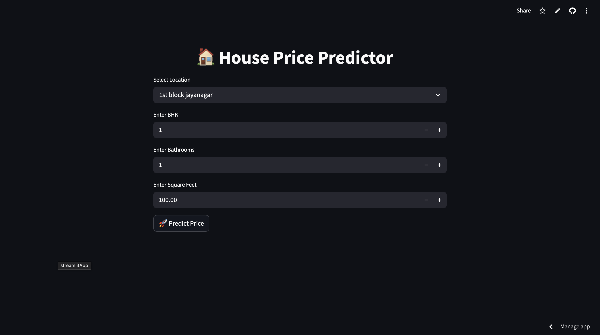

# 🏠 House Price Prediction Web App

A Machine Learning-based web application that predicts house prices based on user inputs such as location, BHK, bathrooms, and square footage.

---

## 🚀 Live Demo

🔗 https://house-price-prediction-wou28fiafappfrtfxvsbbfh.streamlit.app/

---

## 📸 App Preview

---

## 📌 Features

- Real-time house price prediction
- User-friendly interface using Streamlit
- Location-based predictions
- Input validation for accurate results
- Fast and responsive UI

---

## 🛠️ Tech Stack

- **Programming Language:** Python  
- **Libraries:** Pandas, NumPy  
- **Machine Learning:** Scikit-learn (Ridge Regression)  
- **Framework:** Streamlit  
- **Version Control:** Git & GitHub  

---

## 📂 Project Structure
house-price-prediction/
│── data/
│   ├── raw/
│   ├── processed/
│
│── model/
│   └── model.pkl
│
│── notebook/
│   └── House_Price_Predictor.ipynb
│
│── app.py
│── requirements.txt
│── README.md

---

## ⚙️ How to Run Locally

1. Clone the repository:
git clone https://github.com/sanjanakrrai/house-price-prediction.git

2. Navigate to project folder:
cd house-price-prediction

3. Install dependencies:
pip install -r requirements.txt

4. Run the app:
streamlit run app.py

---

## 🧠 Machine Learning Model

- Regression-based model (Ridge Regression)
- Trained on Bengaluru housing dataset
- Feature Engineering + Data Cleaning applied

---

## 📈 Future Improvements

- Add more features (area type, availability, etc.)
- Improve model accuracy
- Deploy using Docker
- Add user authentication

---

## 👨‍💻 Author

**Sanjana Kumari**  
B.Tech (IT) | Machine Learning Enthusiast  

---

## ⭐ Show Your Support

If you like this project, give it a ⭐ on GitHub!
